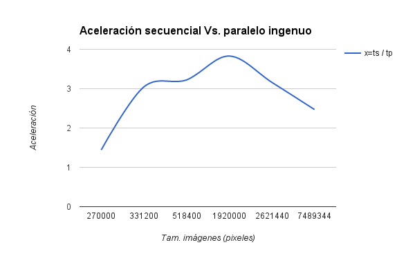
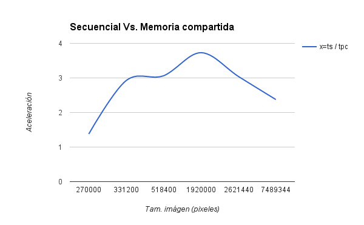
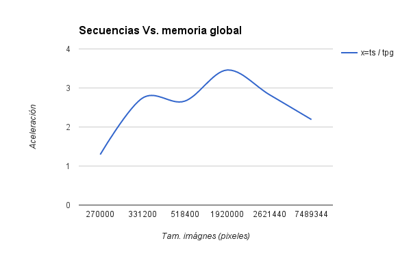
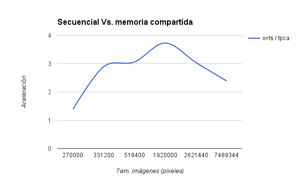
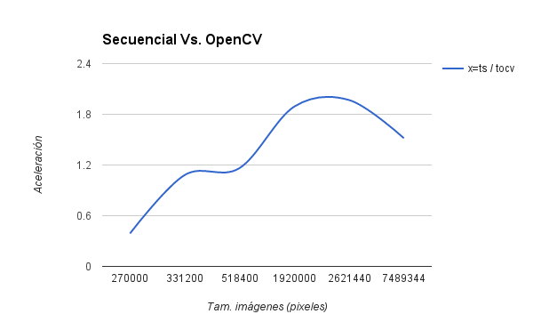

# Sobel
### Conversión de imágenes a escala de grises
#### Introducción
Se realizó la codificación de 5 algoritmos los cuales deben cumplir con el mismo objetivo, para así realizar una comparación de desempeño entre ellos, el objetivo de los algoritmos consta de convertir una imágen a escala de grises. Cada algoritmo se encuentra en una carpeta de código fuente separada para facilitar su compilación y/o ejecución, encontrandonos con el siguiente contenido por carpetas:
- **grises:** implementación secuencial implementada en *C*.
- **grises_cache:** implementación paralela implementada en *Cuda C* haciendo uso de caché.
- **grises_compartida:** implementación paralela implementada en *Cuda C* haciendo uso de memoria compartida.
- **grises_global:** implementación paralela implementada en *Cuda C* haciendo uso de memoria global.
- **grises_paralelo:** implementación paralela implementada en *Cuda C*.

Además una carpeta de nombre *media* en la cual se encuentran las imágenes usadas en la ejecución y en el análisis de tiempos que se presentará a continuación. Dichos algoritmos fueron ejecutados en una GPU Nvidia Gforce GTx 980, la cual fue puesta a disposición para pruebas del curso de computación de alto desempeño, *High Performance Computing (HPC)*, por el semillero de la facultada de ingenierías *Sirius*.

A continuación se muestran las tablas con los datos obtenidos en las pruebas comparativas las cuales usan los siguientes datos:

- **Ts:** tiempo de ejecución del algoritmo secuencial.
- **Tp:** tiempo de ejecución del algoritmo paralelo ingenuo.
- **Tpc:** tiempo de ejecución del algoritmo paralelo haciendo uso de caché.
- **Tpg:** tiempo de ejecución del algoritmo paralelo haciendo uso de memoria global.
- **Tpca:** tiempo de ejecución del algoritmo paralelo haciendo uso de memoria compartida.
- **OpenCV:** tiempo de ejecución del algoritmo de la librería de OpenCV.

A continuación se muestran las tablas con los condesados de promedios de aceleraciones para los algoritmos, los cuales fueron ejecutados con 6 imágenes con las siguientes diferentes resoluciones:

- 600x450
- 720x460
- 960x540
- 1600x1200
- 2048x1280
- 3648x2053

**Nota:** *se usó un Block size de 32 en los algoritmos acá analizados*.

#### Tabla de aceleración algoritmo secuencial Vs. paralelo ingenuo

**Tamaño imágen (pixeles)**|	**Ts**|	**Tp**|	**x=ts / tp**
----------|-----------|-------|-------|--------------
270000|	0.0015184	|0.001053	|1.441975309
331200|	0.003898	|0.00128	|3.0453125
518400|	0.0060382	|0.0018746|	3.221060493
1920000|	0.0226328|	0.005909|	3.83022508
2621440	|0.0243262|	0.007695	|3.161299545
7489344	|0.05374|	0.0217564	|2.47007777

####Gráfica de aceleración

#### Tabla de aceleración algoritmo secuencial Vs. paralelo con memoria caché

**Tamaño imágen (pixeles)**|	**Ts**|	**Tpc**|	**x=ts / tpc**
----------|-----------|-------|-------|--------------
270000|	0.0015184	|0.0011016|	1.378358751
331200|	0.003898	|0.001333	|2.924231058
518400|	0.0060382	|0.0019718|	3.062278122
1920000|	0.0226328|	0.0060666|	3.730722316
2621440	|0.0243262|	0.007996	|3.042296148
7489344	|0.05374|	0.0226258	|2.375164635

####Gráfica de aceleración

#### Tabla de aceleración algoritmo secuencial Vs. paralelo con memoria global

**Tamaño imágen (pixeles)**|	**Ts**|	**Tpg**|	**x=ts / tpg**
----------|-----------|-------|-------|--------------
270000|	0.0015184	|0.0011728	|1.2946794
331200|	0.003898	|0.001422	|2.741209564
518400|	0.0060382	|0.0022676|	2.662815311
1920000|	0.0226328|	0.0065422|	3.459509034
2621440	|0.0243262|	0.0085912	|2.831525282
7489344	|0.05374|	0.0245256	|2.191179828

####Gráfica de aceleración

#### Tabla de aceleración algoritmo secuencial Vs. paralelo con memoria compartida

**Tamaño imágen (pixeles)**|	**Ts**|	**Tpca**|	**x=ts / tpca**
----------|-----------|-------|-------|--------------
270000|	0.0015184	|0.0010964|	1.384896023
331200|	0.003898	|0.0013462|	2.895557867
518400|	0.0060382	|0.0019726|	3.061036196
1920000|	0.0226328|	0.0060628|	3.733060632
2621440	|0.0243262|	0.007988	|3.045343015
7489344|	0.05374|	0.02248	|2.390569395

####Gráfica de aceleración

#### Tabla de aceleración algoritmo secuencial Vs. OpenCV

**Tamaño imágen (pixeles)**|	**Ts**|	**Tpca**|	**x=ts / tpca**
----------|-----------|-------|-------|--------------
270000|	0.0015184	|0.0038978	|0.3895530812
331200|	0.003898	|0.0036028	|1.081936272
518400|	0.0060382	|0.0051904	|1.163340012
1920000|	0.0226328|	0.0119642	|1.891710269
2621440	|0.0243262|	0.0123566	|1.968680705
7489344	|0.05374|	0.0354154	|1.517418976

####Gráfica de aceleración

*Ver tablas completas con el conjunto de datos con los cuales se obtuvieron los anteriores promedios*
[Ver tablas](https://docs.google.com/spreadsheets/d/1nMzIuVj2gX57MlODr3qu_52LIvwRRmH1ptNFancDwIQ/edit?usp=sharing)

####Conclusiones

- **1)**Los dos algoritmos implementados para su ejecución en paralelo obtuvieron un mejor desempeño con respecto a la implementación secuencial.
- **2)**Se observa que gracias al uso de memoria compartida se logra un desempeño aún mayor que la solución paralela ingenua.
